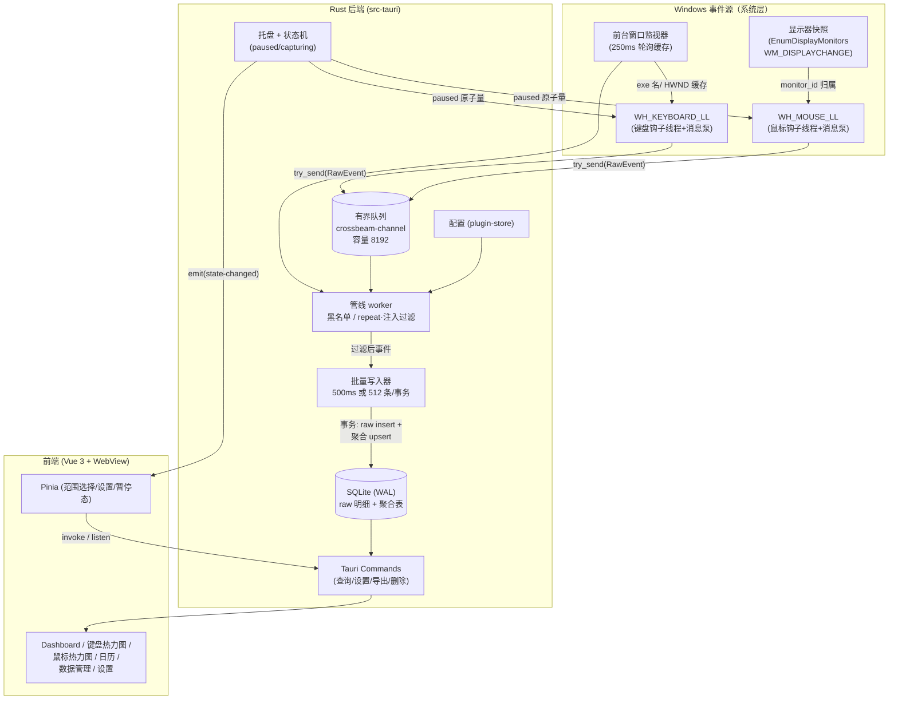

# TypeTrek — PC 端键盘鼠标行为统计程序开发计划

## 目标（Objective）

构建一个**仅限本机、本人使用、明确知情同意**的键盘/鼠标行为统计桌面应用（工作名 TypeTrek）：全局采集按键与鼠标事件，本地 SQLite 存储，提供键盘热力图（104 键布局）、屏幕点击热力图（多显示器）、月历活跃度视图、数据导入导出与隐私控制。程序默认完全离线、不隐藏运行、可随时暂停/退出、可排除敏感应用、不记录任何明文输入内容。

> **合规底线（不可妥协）**：键盘全局监听在技术性质上属于 keylogger。本程序的合法性建立在三个前提上：① 安装在本人拥有/使用的设备上；② 设备实际使用者（即本人）在首启页面**明确知情并同意**；③ 数据仅存本地、不上传、不共享。程序不得用于监控他人，不得提供任何隐蔽运行能力（无隐藏进程、无静默安装、托盘图标不可关闭）。若设备属公司/学校所有，使用者有责任先确认组织政策。本程序定位为个人效率统计工具，不是监控软件，后续所有设计决策均不得突破此定位。

## 现状（Current state）

对 `F:\proj\typetrek` 的实地检查结果（2026-09-21）：

- 已有 Tauri 2 官方脚手架：前端 **Vue 3.5 + TypeScript 6 + Vite 8**（`package.json`，包管理器 **pnpm**，见 `tauri.conf.json` 的 `beforeDevCommand: pnpm dev`）；Rust 侧 `src-tauri` 仅有 `greet` 示例命令，依赖只有 `tauri`、`tauri-plugin-opener`、`serde`。
- 前端只有 `src/App.vue` 模板页，无路由、无状态管理、无测试框架。
- 无 git 仓库（`Is a git repository: no`），`.gitignore` 已存在。
- `AGENTS.md` 约定（对本计划有约束力）：① plan/spec 等文档全部中文；② 新增方法必须配单元测试；③ 测试驱动开发；④ 新增配置项必须加注释说明用途。
- `tauri.conf.json`：`identifier: com.dengqn.app.typetrek`，主窗口 800×600，bundle targets "all"。
- 缺口：采集内核（全局钩子）、数据层、聚合管线、全部统计 UI、设置/隐私体系、打包配置均不存在。

**本计划注意**：用户请求中提到 React 仅为常见默认，实际脚手架是 Vue 3，本计划按 Vue 3 编写前端选型，不重搭脚手架。

## 范围（Scope）

### 范围内（In scope）

- Windows 10/11 x64 为第一平台的完整功能实现（采集、存储、聚合、四类可视化、数据管理、设置、隐私控制）。
- 键盘热力图（104 键 ANSI 布局 + 87 键 TKL 布局，可扩展 JSON 布局文件）。
- 鼠标点击热力图（多显示器布局重建、DPI/分辨率缩放、网格聚合渲染）。
- 月历活跃度视图与单日详情。
- CSV/JSON 导出、按日期删除、保留期自动清理。
- 敏感应用黑名单、隐私模式（仅聚合不落明细）、一键暂停/恢复（托盘 + 可选全局快捷键）。
- 首启知情同意流程、常驻托盘、开机自启（默认关）。
- 数据库加密开关（SQLCipher，默认关、可开）——M4 必做。
- NSIS 安装包 + 绿色免安装 zip 的打包方案。
- macOS / Linux 的**权限差异说明与原型级方案**（完整支持列为 v1.x，见 T28）。

### 范围外（Out of scope）

- **任何形式的明文输入记录**：不存字符、不存按键序列合成文本、不存剪贴板、不截屏。
- **鼠标移动轨迹与滚轮事件**（拷问决策：鼠标侧只记 5 种按钮的按下）。
- **窗口标题采集**（拷问决策：彻底不实现，只记前台应用 exe 名）。
- 任何网络上传、云同步、遥测、自动更新下载（程序构建后零外联，验证见 T27）。
- 隐蔽运行、反检测、对抗杀软识别的能力（明确反向目标：行为透明可审计）。
- 多用户、账户体系、跨设备。
- 文本重建、按键序列分析、AI 行为分析等"从计数到内容"的功能（与隐私底线冲突）。
- Windows 之外的完整功能交付（T28 仅做原型验证）。
- 移动端（Tauri mobile）。

## 1. 需求澄清问题（已于 2026-09-21 拷问确认）

以下问题经 grill-me 逐项拷问后**全部闭环**，"❓跳过"表示用户未作答、按默认方案执行（随时可低成本改判）：

| # | 问题 | 决策 |
|---|------|------|
| Q1 | 按键重复（OS 自动重复连发）是否计入？ | ❓跳过 → 默认**排除** repeat，设置保留切换开关（聚合存原始计数，口径在查询层，改判零成本） |
| Q1b | 键盘 KeyUp（释放）是否落库？ | ❓跳过 → **记录 Down/Up 两相**（`phase` 字段），统计只用 Down；为"按键时长"扩展预留，数据量可接受 |
| Q2 | 鼠标移动轨迹（move 采样）默认状态？ | ✅**彻底不做**：从计划删除 move 采集、降采样模块与相关 UI |
| Q3 | 窗口标题是否记录？ | ✅**彻底不做**：只记前台应用 exe 名，不实现标题开关与存储 |
| Q4 | 鼠标事件范围？ | ✅**只记按下（Down）× 5 种按钮**：左、右、中、侧键 X1/X2（侧键为新增）；滚轮删除 |
| Q5 | 数据库加密取舍？ | ✅**提进 M4 必做**（T24 升级为正式任务：SQLCipher 开关，默认关、可开） |
| Q6 | 是否需要便携版？ | ✅确认**双形态**：NSIS 安装包 + 免安装绿色 zip |
| Q7 | 跨平台"兼顾"程度？ | ✅**原型级即可**（T28 保持 v1.x 可选），完整支持不进 v1.0 |
| Q8 | UI 组件库？ | ❓跳过 → **Naive UI**（TypeScript 优先、主题定制强，与自绘热力图协调） |
| Q9 | MVP 切片时机？ | ❓跳过 → **M3 一次成型**，不发中间版本 |
| Q10 | 隐私模式导致无法导出明细？ | ❓跳过 → **接受**（隐私模式即"链路不存时序数据"的极端模式） |
| Q11 | 聚合数据保留策略？ | ✅**聚合永久保留**，raw 明细 90 天自动清理 |
| Q12 | 主窗口关闭按钮行为？ | ✅**隐藏到托盘 + 气泡提示**"已最小化到托盘，仍在采集中"（首次提示，不打扰） |

## 2. 默认假设与决策（Assumptions and decisions）

- **D1 前端框架：Vue 3**（沿用现有脚手架与 `AGENTS.md` 约定），状态管理用 Pinia，图表用 Apache ECharts（自带日历热力图），键盘/屏幕热力图自绘（SVG/Canvas）。
- **D2 采集实现：Windows 上直接用 `windows` crate 调 Win32 低级钩子**（`WH_KEYBOARD_LL` / `WH_MOUSE_LL`），不用 `rdev`。理由：① Tauri 2 已依赖 `windows` 生态，无新依赖分叉；② `rdev` 对钩子超时、注入事件过滤、DPI 等细节控制不足；③ Windows 是第一平台，值得原生实现。采集层以 `EventSource` trait 抽象，为 macOS（`core-graphics` CGEventTap）/Linux（X11 `x11-dl`）留接口。
- **D3 存储：rusqlite（bundled SQLite）+ WAL**，迁移用 `PRAGMA user_version` + 手写迁移模块（个人项目规模，不引入 refinery）。设置存 `tauri-plugin-store` 的 JSON 文件而非数据库，避免"加密库打不开连设置也锁死"。
- **D4 键码命名：采用 Web `KeyboardEvent.code` 风格**（`KeyA`、`Digit1`、`Space`、`ShiftLeft`），跨平台稳定、与布局 JSON 直接对应、不含字母明文歧义。
- **D5 日期切分：本地时区**（chrono `Local`），聚合表主键为 `YYYY-MM-DD` 文本。
- **D6 raw 明细与聚合分离**：聚合表随批量写入同事务增量更新，保证崩溃一致；raw 明细默认保留 90 天自动清理，聚合永久保留（除非手动删）。
- **D7 隐私模式语义**：开启后 raw 表完全不写入（仅内存聚合 → 聚合表），从根源上消除"按键时间序列可被部分还原输入内容"的风险。
- **D8 单人开发**：按每天 6 小时有效编码估算，核心范围约 **104 小时 ≈ 17 个工作日**。
- **D9 遵守 `AGENTS.md`**：所有新模块先写失败单测再实现（TDD）；`Cargo.toml`、`config.rs`、`tauri.conf.json`（Tauri 2 支持 JSONC 注释）中的新配置一律带用途注释。
- **D10 鼠标事件最小化**（拷问决策）：只记 5 种按钮（left/right/middle/X1/X2）的按下，无滚轮、无移动轨迹；`mouse_events.kind` 取消，`RawEvent` 删除 `delta_y`。
- **D11 窗口标题永不采集**（拷问决策）：`GetWindowTextW` 不出现在代码库；前台识别仅 exe 名。
- **D12 UI 组件库：Naive UI**（跳过→默认），配合 ECharts 与自绘热力图。
- **D13 加密是 v1.0 承诺**：T24 为 M4 正式任务；主窗口关闭 = 隐藏托盘 + 首次气泡提示仍在采集。
- **D14 版本控制**：项目当前不是 git 仓库；执行 T1 前建议先 `git init` 并提交脚手架+计划基线（是否执行由用户决定，本计划不代为提交）。

## 3. 推荐技术栈与理由

| 层 | 选型 | 理由 |
|----|------|------|
| 应用框架 | Tauri 2（已就位） | Rust 后端可常驻采集、内存占用远低于 Electron；WebView2 复用系统组件 |
| 前端 | Vue 3.5 + `<script setup>` + Pinia + Vue Router + **Naive UI** | 与现有脚手架一致；Pinia 是 Vue 官方状态方案；Naive UI 覆盖表单/对话框/列表（拷问决策 Q8） |
| 构建 | Vite 8 + vue-tsc（已就位） | 脚手架默认，`pnpm build` 已含类型检查 |
| 图表 | Apache ECharts 6（`echarts` 直接用，不用 vue-echarts 包装） | 内置 calendar heatmap、饼图、折线图；canvas 渲染性能好 |
| 键盘热力图 | 自绘 SVG 组件 | 104 键是不规则网格，SVG 按布局 JSON 排版最直接、可交互（tooltip/点击） |
| 屏幕热力图 | 自绘 Canvas（灰度 alpha 累积 + 色带 LUT 上色，即 heatmap.js 同款算法） | 数据量最大处性能可控，多显示器布局自由 |
| 采集（Windows） | `windows` crate：`WH_KEYBOARD_LL` / `WH_MOUSE_LL` | 原生、可控、无中间层；见 D2 |
| 前台应用 | `GetForegroundWindow` + `GetWindowThreadProcessId` + `QueryFullProcessImageNameW` | 取 exe 名（不含窗口路径歧义）；250ms 缓存刷新降低开销 |
| 多显示器 | `EnumDisplayMonitors` / `GetMonitorInfoW` | 拿虚拟桌面坐标 + 物理分辨率 + 主屏标记 |
| 存储 | `rusqlite`（feature `bundled`） | 无系统 SQLite 依赖，版本锁定；WAL 模式适配"高频小事务+读" |
| 队列 | `crossbeam-channel`（bounded） | 钩子回调 `try_send` 非阻塞，天然背压策略 |
| 线程/时间 | `std::thread` + `chrono` | chrono 处理本地日期切分与序列化 |
| Tauri 插件 | `store` / `autostart` / `single-instance` / `global-shortcut` / `dialog` | 官方插件覆盖设置持久化、自启、单实例、暂停快捷键、导出对话框 |
| 加密（增强） | `rusqlite` feature `bundled-sqlcipher` + `keyring`（OS 凭据库） | 密钥进 Windows 凭据管理器，不落盘 |
| 测试 | Rust 内建 `#[test]` + 前端 Vitest | 契合 AGENTS.md TDD 约定 |
| 打包 | Tauri bundler（NSIS）+ 手工绿色 zip | 见第 16 节 |

## 4. 系统架构：模块图与数据流

### 模块图



### 事件流（采集 → 队列 → 批量写入 → 聚合 → UI 查询）

1. **采集**：钩子线程回调里只做三件事——读 `paused` 原子量（暂停则直接丢弃）、过滤 injected/repeat（键盘）、组装 `RawEvent` 并 `try_send` 入队。**回调内禁止任何 IO、锁竞争、进程查询**（Win32 对低级钩子回调有超时机制，超时会被系统静默摘除钩子，见 R1）。队列满时丢弃并递增 `dropped` 计数（保命优先于完整）。
2. **前台应用归属**：事件入队时只带 `HWND` 快取值（由独立 250ms 轮询线程维护"HWND → exe 名 → apps 表 id"缓存）；管线 worker 从缓存解析 `app_id`，黑名单在此判定并丢弃。
3. **过滤**：注入事件按 `ignore_injected` 设置过滤（默认丢弃，AutoHotkey 用户可关）；键盘 repeat 仅打标记；鼠标只接受 5 种按钮的按下（左/右/中/X1/X2），move 与滚轮在钩子层直接忽略。
4. **批量写入**：写入器积攒事件，**500ms 或 512 条**先到者触发，单事务内完成：raw 表批量 insert（预编译语句）+ 各聚合表 `INSERT ... ON CONFLICT DO UPDATE SET count = count + excluded.count`。崩溃一致性由事务保证。优雅退出时强制 flush。
5. **聚合**：即第 4 步同事务增量更新（`agg_key_daily` / `agg_mouse_daily` / `agg_click_grid_daily` / `agg_app_daily` / `agg_hour_daily`），因此**任意查询都只打聚合表**，O(天数×键数) 而非 O(事件数)。
6. **UI 查询**：前端通过 Tauri command 查询聚合表；范围变化/手动刷新时重新拉取，不做推送（避免常驻开销）。托盘暂停状态用 `emit` 推给前端。

### 建议目录结构（新增部分，现有脚手架文件保留）

```
typetrek/
├── AGENTS.md                    # 已有，遵守其约定
├── package.json                 # 已有（补 vitest、echarts、pinia、vue-router）
├── index.html  vite.config.ts   # 已有
├── layouts/                     # 键盘布局 JSON（前端读取，静态资源）
│   ├── ansi-104.json
│   └── tkl-87.json
├── src/                         # 前端
│   ├── main.ts  App.vue         # 已有，改造
│   ├── router/index.ts          # 页面路由
│   ├── stores/                  # Pinia：range.ts / settings.ts / runtime.ts
│   ├── routes/                  # Onboarding / Dashboard / Keyboard / Mouse / Calendar / Data / Settings
│   ├── components/
│   │   ├── KeyboardHeatmap.vue  # SVG 键盘热力图
│   │   ├── ScreenHeatmap.vue    # Canvas 屏幕点击热力图（多显示器）
│   │   ├── CalendarHeat.vue     # ECharts 日历热力图
│   │   ├── RangePicker.vue      # 日/周/月/自定义
│   │   ├── TopList.vue          # Top 键 / Top 区域
│   │   └── ConsentGate.vue      # 首启知情同意
│   ├── lib/
│   │   ├── ipc.ts               # Tauri invoke 封装 + 类型定义（与 Rust 结构一一对应）
│   │   ├── colorscale.ts        # log+分位数色阶纯函数（单测）
│   │   └── layout.ts            # 布局 JSON 解析（单测）
│   └── assets/
├── src-tauri/
│   ├── Cargo.toml  tauri.conf.json  capabilities/default.json   # 已有，扩充
│   └── src/
│       ├── main.rs  lib.rs      # 入口与插件注册
│       ├── config.rs            # 配置结构体 + 默认值（每项带注释，遵守 AGENTS.md）
│       ├── state.rs             # AppState：paused(AtomicBool)、队列句柄、 dropped 计数
│       ├── db/
│       │   ├── mod.rs           # 连接管理（WAL、busy_timeout）
│       │   ├── migrations.rs    # PRAGMA user_version 迁移器
│       │   ├── schema.rs        # DDL 常量
│       │   ├── dao.rs           # 批量 insert / 聚合 upsert / 查询 / 删除
│       │   └── export.rs        # CSV/JSON 流式导出
│       ├── capture/
│       │   ├── mod.rs           # EventSource trait + 启停编排
│       │   ├── event.rs         # RawEvent / EventKind / MouseButton 定义
│       │   ├── keyboard_win.rs  # WH_KEYBOARD_LL
│       │   ├── mouse_win.rs     # WH_MOUSE_LL
│       │   ├── keymap.rs        # VK → KeyboardEvent.code 风格命名（纯函数，重点单测）
│       │   ├── foreground.rs    # 前台窗口缓存线程
│       │   └── monitors.rs      # 显示器快照 + 坐标归属（纯函数，重点单测）
│       ├── pipeline/
│       │   ├── mod.rs           # worker 主循环
│       │   ├── batcher.rs       # 批量写入触发策略（500ms/512 条）
│       │   └── blacklist.rs     # 黑名单匹配（纯函数，单测）
│       ├── commands/            # Tauri command 层（薄封装，参数校验）
│       ├── tray.rs              # 托盘菜单与状态
│       └── bin/bench_events.rs  # 压测：模拟高频事件入队（性能验收用）
└── plans/  docs/                # 本计划；隐私声明与合规说明（T27 交付）
```

## 5. 数据库表结构（含字段与索引）

数据库文件：`%APPDATA%/com.dengqn.app.typetrek/typetrek.db`（经 Tauri `app_data_dir` 解析）。`PRAGMA journal_mode=WAL; PRAGMA busy_timeout=2000; PRAGMA synchronous=NORMAL;`

```sql
-- 迁移版本：PRAGMA user_version = 1

-- 会话：每次进程启动一条，用于数据血缘与调试
CREATE TABLE sessions (
  id          INTEGER PRIMARY KEY,          -- 自增
  started_at  INTEGER NOT NULL,             -- unix 毫秒
  ended_at    INTEGER,                      -- 优雅退出时回填
  app_version TEXT NOT NULL                 -- 排查历史数据问题
);

-- 前台应用字典（exe 名去重；不含路径与窗口标题）
CREATE TABLE apps (
  id            INTEGER PRIMARY KEY,
  exe_name      TEXT NOT NULL UNIQUE,       -- 小写规范化，如 "chrome.exe"
  friendly_name TEXT,                       -- 用户可编辑别名（UI 用）
  first_seen    INTEGER NOT NULL,
  last_seen     INTEGER NOT NULL
);

-- 显示器快照（分辨率/布局变化时新插或更新 last_seen，历史快照保留以解释旧坐标）
CREATE TABLE monitors (
  id         INTEGER PRIMARY KEY,
  device_key TEXT NOT NULL UNIQUE,          -- 稳定标识（设备路径哈希）
  is_primary INTEGER NOT NULL DEFAULT 0,
  x          INTEGER NOT NULL,              -- 虚拟桌面坐标（物理像素）
  y          INTEGER NOT NULL,
  width      INTEGER NOT NULL,
  height     INTEGER NOT NULL,
  scale      REAL NOT NULL DEFAULT 1.0,     -- DPI 缩放
  first_seen INTEGER NOT NULL,
  last_seen  INTEGER NOT NULL
);

-- 键盘明细。隐私关键设计：只存键码标识+相位的"计数原料"，
-- 不做字符合成；敏感应用事件在此表之前已被丢弃
CREATE TABLE key_events (
  id         INTEGER PRIMARY KEY AUTOINCREMENT,
  ts         INTEGER NOT NULL,              -- unix 毫秒（事件发生时刻）
  session_id INTEGER NOT NULL REFERENCES sessions(id),
  key_code   TEXT NOT NULL,                 -- "KeyA"/"Space"/"ShiftLeft"（D4）
  phase      INTEGER NOT NULL,              -- 0=Down 1=Up
  is_repeat  INTEGER NOT NULL DEFAULT 0,    -- OS 自动重复标记
  is_injected INTEGER NOT NULL DEFAULT 0,   -- 软件注入事件（AutoHotkey 等）；ignore_injected=true（默认）时不入队，关闭时可记录以支持自动化工具用户
  app_id     INTEGER REFERENCES apps(id)    -- 事件时刻前台应用
);
CREATE INDEX idx_key_events_ts       ON key_events(ts);            -- 按日期删除/导出/保留期清理
CREATE INDEX idx_key_events_code_ts  ON key_events(key_code, ts);  -- 单键时间线

-- 鼠标明细（拷问决策：只记 5 种按钮的按下；无滚轮、无移动轨迹）
CREATE TABLE mouse_events (
  id         INTEGER PRIMARY KEY AUTOINCREMENT,
  ts         INTEGER NOT NULL,
  session_id INTEGER NOT NULL REFERENCES sessions(id),
  button     TEXT NOT NULL,                 -- 'left'|'right'|'middle'|'x1'|'x2'
  x          INTEGER NOT NULL,              -- 虚拟桌面坐标（物理像素）
  y          INTEGER NOT NULL,
  monitor_id INTEGER REFERENCES monitors(id),
  app_id     INTEGER REFERENCES apps(id)
);
CREATE INDEX idx_mouse_ts ON mouse_events(ts);
```

```sql
-- ===== 聚合表（批量写入同事务增量 upsert；查询只打这里） =====

-- 点击网格日聚合：屏幕热力图专用，避免渲染时扫 raw
CREATE TABLE agg_click_grid_daily (
  date       TEXT NOT NULL,                 -- 'YYYY-MM-DD' 本地时区
  monitor_id INTEGER NOT NULL REFERENCES monitors(id),
  cell_x     INTEGER NOT NULL,              -- 网格索引，cell 尺寸默认 24px（设置可改 16/24/32/64）
  cell_y     INTEGER NOT NULL,
  count      INTEGER NOT NULL DEFAULT 0,
  PRIMARY KEY (date, monitor_id, cell_x, cell_y)
);

-- 键盘日聚合：热力图/Top 键/占比
CREATE TABLE agg_key_daily (
  date     TEXT NOT NULL,
  key_code TEXT NOT NULL,
  count    INTEGER NOT NULL DEFAULT 0,      -- 仅统计 phase=Down 且 NOT is_repeat（管线保证）
  PRIMARY KEY (date, key_code)
);

-- 鼠标日聚合：五类按钮分布
CREATE TABLE agg_mouse_daily (
  date  TEXT NOT NULL,
  button TEXT NOT NULL,                     -- 'left'|'right'|'middle'|'x1'|'x2'
  count INTEGER NOT NULL DEFAULT 0,
  PRIMARY KEY (date, button)
);

-- 应用日聚合：按应用统计（黑名单应用永远不会出现在这里）
CREATE TABLE agg_app_daily (
  date        TEXT NOT NULL,
  app_id      INTEGER NOT NULL REFERENCES apps(id),
  key_count   INTEGER NOT NULL DEFAULT 0,
  click_count INTEGER NOT NULL DEFAULT 0,
  PRIMARY KEY (date, app_id)
);

-- 小时聚合：日内趋势
CREATE TABLE agg_hour_daily (
  date       TEXT NOT NULL,
  hour       INTEGER NOT NULL,              -- 0-23 本地时
  key_count  INTEGER NOT NULL DEFAULT 0,
  click_count INTEGER NOT NULL DEFAULT 0,
  PRIMARY KEY (date, hour)
);
```

**数据量评估**（设计依据）：重度使用者 ≈ 3 万按键 + 5000 点击/天；raw 90 天 ≈ 320 万行 ≈ 150~250MB（含索引），SQLite 无压力；聚合表 90 天 ≈ (键种 110 + 按键 4 + 应用 30 + 小时 24) × 90 ≈ 1.5 万行。**保留期默认：raw 90 天自动清理，聚合永久**。

## 6. 核心模块设计

### 6.1 `capture/event.rs` — 事件契约

```rust
pub enum EventKind { KeyDown, KeyUp, Click }
pub enum MouseButton { Left, Right, Middle, X1, X2 }   // 侧键 X1/X2（拷问决策 Q4）

pub struct RawEvent {
    pub ts_ms: i64,                    // 采集时刻（GetTickCount64 校正 unix 时钟）
    pub session_id: i64,
    pub kind: EventKind,
    pub key_code: Option<compact_str::CompactString>, // "KeyA"
    pub button: Option<MouseButton>,
    pub x: Option<i32>, pub y: Option<i32>,           // 虚拟桌面物理坐标（仅 Click）
    pub monitor_id: Option<i64>,
    pub hwnd_foreground: isize,        // 回调时快照，worker 侧解析 app_id
    pub is_repeat: bool,
    pub is_injected: bool,
}
```

键鼠钩子各自跑在带消息泵的独立线程（`SetWindowsHookExW` 要求回调线程 pump 消息）。`EventSource` trait：`start(tx) -> JoinHandle` / `stop()`，Windows 实现之外留 macOS/Linux 实现位。

### 6.2 `capture/keymap.rs` — 键码映射（TDD 重点）

纯函数 `vk_to_code(vk: u32, scan: u32, ext: bool) -> Option<Code>`，映射表约 150 项（A–Z、0–9、F1–F24、修饰键区分左右 `ShiftLeft/ShiftRight`、`Numpad0-9`、`Space`、`Enter`、`Backspace`、IME 处理：中文输入法下 VK 仍为字母键码，`ProcessKey` 等虚拟码归为 `IMEProcess` 单独桶）。单测覆盖：全表映射、扩展键（RightCtrl/NumPad）、未知键返回 None。

### 6.3 `capture/monitors.rs` — 多显示器（TDD 重点）

- 快照：`EnumDisplayMonitors` → ` monitors` 表 upsert（device_key 用 `GetMonitorInfoW.szDevice` + EDID 稳定哈希）。
- 归属：`point_to_monitor(x, y, monitors) -> Option<id>` 纯函数（rect 含左/上、不含右/下；坐标原点为虚拟桌面左上角，可能为负）。
- 刷新：`WM_DISPLAYCHANGE` 无法直接投递到钩子线程，用快照线程每 30s 轮询 + 布局哈希变更时重建（简单可靠，开销可忽略）。
- 单测：负坐标屏、主屏左侧、边界点、屏幕热插拔后旧 monitor_id 仍可解引用（`last_seen` 语义）。

### 6.4 `capture/foreground.rs` — 前台应用缓存

250ms 轮询：`GetForegroundWindow` → HWND 变化才查询 `GetWindowThreadProcessId` + `OpenProcess(PROCESS_QUERY_LIMITED_INFORMATION)` + `QueryFullProcessImageNameW` → 文件名小写 → `apps` 表 upsert（写入器负责，缓存线程只发"新 exe 发现"消息）。缓存结构 `DashMap<HWND, AppInfo>`；黑名单在 worker 判定。**不调用 `GetWindowTextW`**（可能卡死在被挂起的窗口；且窗口标题永不采集，见 D11）。

### 6.5 `pipeline/` — 节流、黑名单、批量写入

- `blacklist.rs`：匹配 `exe_name` 精确小写匹配 + 可选通配符（`*bank*`）；键盘/鼠标分别可配（`blacklist_keys` / `blacklist_mouse`，默认都生效）。
- `batcher.rs`：`Arc<Mutex<Vec<RawEvent>>>` 攒批，500ms 定时或 512 条触发 flush；flush 在**单个事务**内：N 条 raw insert（预编译 stmt 复用）+ `agg_key_daily` 等五表 upsert（`INSERT ... ON CONFLICT(date,key) DO UPDATE SET count=count+excluded.count`）+ `sessions`/`apps`/`monitors` 元数据更新。每批一个事务，崩溃最多丢最近 500ms 队列内事件，绝不出现半批。
- 队列：`crossbeam_channel::bounded(8192)`；`try_send` 失败 → `dropped.fetch_add(1)`；`dropped` 与队列长度暴露给 UI（运行状态页）。

### 6.6 `commands/` — 前端查询契约（前后端接口面）

```
get_runtime_state() -> { paused, capturing, queue_len, dropped_total, db_size_bytes }
set_paused(bool) / get_overview(range) -> { key_total, click_total, active_minutes, by_day[] }
get_keyboard_stats(range)  -> { total, keys:[{code,count,ratio}], by_hour:[...] }
get_mouse_stats(range)     -> { total, by_button:{left,right,middle,x1,x2},
                                monitors:[...], cells:[{monitor_id,cell_x,cell_y,count}] }
get_calendar_stats(month)  -> [{date, key_count, click_count}]
get_day_detail(date)       -> { key_top:[], click_total, by_hour:[...] }
get_monitors() / get_known_apps() / get_settings() / set_settings(patch)
export_data({format: 'csv'|'json', scope: 'agg'|'raw', range, path})
delete_range({start_date, end_date})          -- 同事务删 raw(按 ts 区间) + 五个聚合表(按 date 区间)
```

`Range` 统一为 `{ start_date, end_date }`（本地日期），前端 RangePicker 负责日/周/月/自定义换算。导出走 `tauri-plugin-dialog` 选路径 + Rust 流式写文件（raw 导出前二次确认弹窗，见第 13 节）。

## 7. UI 页面与交互

窗口默认 960×640（改 `tauri.conf.json`），关闭按钮 = 隐藏到托盘，**首次隐藏时气泡提示"已最小化到托盘，仍在采集中"**（拷问决策 Q12，兼顾常规习惯与"不隐藏运行"的透明性）；**托盘图标常驻不可隐藏**（合规要求），托盘菜单：`暂停/恢复`、`打开主面板`、`退出`。侧边栏导航，组件库 Naive UI：

| 页面 | 内容与交互 | MVP |
|------|-----------|-----|
| **Onboarding 知情同意** | 首启全屏页：明确说明采集什么（键码计数、点击坐标）、不采集什么（明文、标题默认、不上传）、如何停止（托盘/快捷键）、数据存哪、怎么删。**必须点击"我已知情并同意"**才启动采集；提供"暂不同意，仅浏览"（采集保持关闭）| ✅ |
| **Dashboard 概览** | 今日按键数/点击数/估计活跃分钟、7 天趋势折线、24 小时分布、快捷暂停按钮（大按钮，状态醒目显示"采集中/已暂停"） | ✅ |
| **键盘热力图** | SVG 104 键（可切 87 键），时间范围选择（日/周/月/自定义），色阶图例、tooltip（键名+次数+占比）、Top 10 键列表、总量。支持布局 JSON 扩展 | ✅ |
| **鼠标热力图** | 按显示器快照重建布局的 Canvas 热力图（可整体缩放、单屏切换），五类按键（左/右/中/X1/X2）分布、Top 5 区域（3×3 分区） | ✅ |
| **日历统计** | ECharts 月历双序列（键盘/鼠标切换），颜色深浅=活跃度；点击某天 → 下方单日详情（Top 键、按钮分布、小时曲线） | ✅ |
| **数据管理** | 导出（CSV/JSON，范围+agg/raw 选择，raw 导出二次确认）、按日期区间删除（需输入日期确认）、立即清理、数据库大小/行数统计、保留期显示 | ✅ |
| **设置** | 开机自启†、采集总开关、键盘/鼠标分开关、黑名单编辑（含"从最近应用一键添加"）、保留期（30/90/180/365 天）、热力图网格粒度（16/24/32/64px）、repeat 计入开关、注入事件过滤开关（默认过滤）、隐私模式开关（+解释）、暂停快捷键设置、加密开关††、打开数据目录 | ✅ |
| **运行状态** | 队列长度、累计丢弃数、钩子是否存活（心跳）、数据库体积——排障用 | 增强 |

† 依赖 Tauri `autostart` 插件；自启时若已同意过则静默最小化到托盘。
†† T24（SQLCipher，M4 必做）：默认关、可开。

## 8. 热力图与统计算法

### 8.1 色阶（键盘/日历/屏幕共用核心，`lib/colorscale.ts`，纯函数单测）

```
输入 counts: number[]
1. v = log1p(count)                      // 压缩长尾：空格/E 键会是字母均值的数十倍
2. lo = P05(v), hi = P99(v)              // 分位裁剪，极值不淹没主体
3. t = clamp((v - lo) / (hi - lo), 0, 1) // 归一化
4. t → 色带 LUT：键盘/日历用 单色渐变（低=底色 高=品牌色），
   屏幕热力图用 经典 蓝→绿→黄→红 热力带
5. count=0 → 底色
```

### 8.2 键盘热力图渲染

- 布局 JSON：`{ rows: [{ y, keys: [{ code, label, x, w, h }] }] }`，u 单位 = 1 键位宽；104 键 ANSI 与 87 键 TKL 两份；`Shift` 等键聚合左右或分开展示（布局文件决定，均可）。
- 数据：`get_keyboard_stats` 返回 `{code: count}`，SFC 里 `v-for` 出 `<rect>`，fill 由色阶函数给出；hover tooltip 显示 `键名 / 次数 / 占比`；点击键 → 该键 30 天趋势（增强）。
- 汇总卡：总次数、最高频键、前 10 键及占比（`TopList` 组件复用）。

### 8.3 屏幕点击热力图（Canvas，heatmap.js 同款两遍算法）

1. 查询 `agg_click_grid_daily`（cell 默认 24px）+ `monitors` 最新快照；
2. 建虚拟桌面画布（所有显示器包围盒，按 `scale` 折算 CSS 像素，窗口内整体 fit 缩放）；
3. **第一遍**：离屏 canvas 灰度累积——每个 cell 画径向渐变圆（半径 ≈ 2.5 cell，中心 alpha = log1p 归一），`globalCompositeOperation='lighter'` 叠加；
4. **第二遍**：`getImageData` 逐像素用 alpha 查 256 级色带 LUT 上色；
5. 显示器边界画细线标注 + 名称标签；hover 显示该 cell 范围与点击数。
- 多显示器/分辨率处理：坐标全部统一在"虚拟桌面物理像素"空间，渲染时一次线性缩放；DPI 不同的显示器由 `scale` 字段在布局折算时处理；单屏查看模式用于大 DPI 屏细节。

### 8.4 日历热力图

ECharts `calendar` series + `visualMap`（piecewise，色阶函数同 8.1），键盘/鼠标两个 series 用顶部切换；单日点击 → `get_day_detail`。

### 8.5 统计口径（唯一权威定义，写入 docs）

- 按键数 = `key_events` 中 `phase=Down AND is_repeat=0` 计数（repeat 计入可在设置改，改动只影响查询层 `WHERE`，聚合表存原始计数，兼容口径切换）。
- 点击数 = `mouse_events` 行数（5 种按钮的按下）；分布 = 按 `button` 分组。
- 活跃分钟（Dashboard 的"估计"）= 当天有键盘或点击事件的**不同分钟数**（小时聚合表推导），明确标注为估算值。

## 9. 隐私与安全设计

### 9.1 威胁模型与对应控制

| 风险 | 控制 |
|------|------|
| 按键序列可被还原成输入文本（raw 表含时序键码，理论上可部分重建打字内容） | **D7 隐私模式**（默认关，开启后 raw 不落盘）；**保留期**默认 90 天清理 raw；数据库文件权限继承用户目录 ACL（仅当前用户可读）；文档明示此残余风险；导出 raw 需二次确认 |
| 窗口标题泄漏敏感内容 | **已从设计上消除**：标题采集彻底不实现（拷问决策 Q3），代码中不存在 `GetWindowTextW` 路径 |
| 密码管理器/银行等应用内行为被记录 | **黑名单在写入前丢弃**（不入内存队列之后任何环节）；UI 提供"从最近应用一键添加"；预置常见名单建议（`1password*`、`keepass*`、`bitwarden*` 等由文档给出建议而非硬编码） |
| 误用于监控他人 | 同意页写明使用边界；托盘图标常驻不可隐藏；无任何"隐藏运行"能力；不混淆、不加壳、开源目录结构 |
| 网络外泄 | 程序无网络代码（Tauri 默认无 HTTP 权限）；构建产物外联验证纳入 T27 验收（防火墙观测 + 依赖审计 `cargo deny` 级别检查可选） |
| 数据库文件被其他本机用户/程序读取 | 默认 `%APPDATA%` 用户级目录（Windows ACL 已限当前用户）；可选 SQLCipher（T24），密钥 `keyring` 存 Windows 凭据管理器 |
| 导出文件泄漏 | 导出 raw 前弹窗提示"导出文件未加密，含按键时序"；导出完成后提示存放路径 |

### 9.2 知情同意与透明度

- 首启 ConsentGate：**不点同意不启动任何钩子**（采集线程根本不创建）；同意状态存设置；托盘菜单与 Dashboard 常驻"采集中/已暂停"状态指示。
- 暂停语义：`paused` 原子量在**钩子回调最先检查**（丢弃早于入队，暂停期间零内存残留），恢复不清队列（队列本就空）。
- 全局快捷键暂停（如 `Ctrl+Alt+P`）默认启用、可改、可关。
- README 与 `docs/privacy.md`（T27 交付）：数据字典、每张表存什么、如何彻底删除（删库文件路径）、卸载残留说明（NSIS 卸载可选删除数据）。

### 9.3 平台全局钩子权限差异（约束要求，逐平台说明）

| 平台 | 机制 | 权限要求 | 注意事项 |
|------|------|----------|----------|
| **Windows 10/11（第一平台）** | `SetWindowsHookExW` 低级钩子 | 无需管理员（同桌面会话即可） | ① 回调超时（注册表 `LowLevelHooksTimeout`，默认约几百 ms）会被系统**静默摘钩**→ 心跳检测 + 自动重装（T3/T25）；② UAC 提权窗口（如管理员任务管理器）因 UIPI 收不到事件，属预期，文档说明；③ 杀软/EDR 可能对全局键盘钩子告警 → 见 R2；④ 锁屏/切换用户期间无事件，属预期 |
| **macOS（T28 原型）** | `CGEventTap`（`listenOnly`） | 需要**辅助功能**权限：系统设置 → 隐私与安全性 → 辅助功能，手动勾选本应用；首次启动用 `AXIsProcessTrustedWithOptions` 拉起授权引导 | 未签名 ad-hoc 自用可行；正式分发需 Developer ID 签名公证；休眠/受管 Mac（MDM）可能拒绝 |
| **Linux X11（T28 原型）** | XRecord 扩展或读 `/dev/input/event*`（evdev） | XRecord 需同 X 会话；evdev 需 `input` 组成员 | 标注"实验性" |
| **Linux Wayland** | 无标准化全局监听 | 合成器安全模型**默认禁止**（libinput 不暴露全局事件给普通客户端） | **明确宣布不支持**，检测到 Wayland 会话时 UI 提示并禁用采集，不静默失败 |

T28 之前，非 Windows 平台在 UI 显示"当前平台支持状态"页，而不是崩溃或假装在工作。

## 10. 开发里程碑（M1–M5）

> 单人 6h/天估算；每个里程碑结束有可运行产物 + 明确验收动作。MVP = M1+M2+M3；M4、M5 为完整 v1.0；T28 为 v1.x 增强。

| 里程碑 | 内容 | 交付物 | 验收标准（可执行） | 工时 |
|--------|------|--------|--------------------|------|
| **M1 采集内核**（T1–T9） | 数据层、双钩子、显示器/前台缓存、批量写入、托盘/暂停、同意页 | 可常驻运行的采集后端（UI 仅 Onboarding+托盘） | ① `cargo test` 全绿；② 挂机采集 4h：任务管理器平均 CPU < 1%、内存（Rust 侧）< 30MB；③ SQLite 中 `key_events`/`mouse_events` 计数与手动抽样一致；④ 托盘暂停后新事件为零；⑤ 强杀进程后重启无半批数据（事务验证） | ~33h |
| **M2 聚合与键盘热力图**（T10–T15） | 查询命令、前端骨架、布局 JSON、SVG 热力图、Dashboard | MVP 前半：键盘统计可用 | ① 聚合 upsert 幂等性单测（重放同批数据计数不翻倍）；② 30 天范围查询 < 300ms（造 300 万行 raw 压测）；③ 热力图颜色与 Top 键排序抽查正确；④ 色阶纯函数单测覆盖 0 值/单值/极值 | ~21h |
| **M3 鼠标热力图与日历**（T16–T19） | 网格聚合、Canvas 热力图、按钮分布、日历页 | **MVP 完整**：四类可视化齐 | ① 双显示器（不同 DPI、主屏在右）下点击归属 100% 正确（人为校验 20 个点）；② 热插拔显示器后 30s 内布局更新；③ 日历与 Dashboard 数字交叉一致 | ~16h |
| **M4 数据管理与隐私**（T20–T24） | 设置页全项、黑名单、导出/删除/保留期、隐私模式、**数据库加密开关（必做）** | v1.0 功能齐 | ① 黑名单应用事件 0 落库（自动化验证：模拟事件流 + 断言）；② 导出 CSV/JSON 可被 Excel/`jq` 正常解析；③ 按日期删除后 raw 与五个聚合表同步减少（事务断言）；④ 隐私模式开启后 raw 表行数零增长；⑤ 保留期清理任务跑通；⑥ 加密开/关切换后库可正常打开，无密钥不可读，密钥存于凭据管理器 | ~22h |
| **M5 打磨与发布**（T25–T27） | 压测调优、测试补齐、NSIS+zip、文档 | v1.0 安装包 | ① 10k 事件/s 压测 5min：丢弃率 < 0.1%、回调无超时摘钩（心跳日志验证）、UI 无卡顿；② 安装包在干净 Win11 虚拟机安装→采集→卸载全流程通过；③ 产物外联为零（防火墙/抓包观测）；④ README + privacy.md 完成 | ~12h |
| **（增强）v1.x**（T28） | macOS CGEventTap 原型 + Linux X11 原型 | 支持状态页 + 平台原型报告 | macOS 授权引导后可采集；Wayland 明确提示不支持 | ~8h |

## 11. 详细任务清单（Implementation plan）

> 每个 Rust 任务遵守 AGENTS.md：先写失败单测（TDD）再实现。估算为专注工时。

### T1 — 数据层与迁移框架

**Targets:** `src-tauri/src/db/`（`mod.rs`、`migrations.rs`、`schema.rs`、`dao.rs`）
**Depends on:** none　**估算:** 4h

- [x] `Cargo.toml` 增加 `rusqlite = { version = "0.40.2", features = ["bundled"] }`、`chrono 0.4.45`、`thiserror 2.0.20`（均含中文用途注释）。
- [x] `migrations.rs`：`PRAGMA user_version` 驱动的迁移器，v1 = 全部 DDL；`db/mod.rs` 打开连接并设置 WAL/busy_timeout/foreign_keys，另含本地日期工具（`ts_to_local_date`/`local_date_range_to_ts` 等）。
- [x] `dao.rs`：`write_batch`（预编译批量 raw 插入 + 五表聚合 upsert，单事务）、`AggBatch` 增量累加器、`delete_range`、`create_session`/`close_session`、`upsert_app`/`upsert_monitor`。（`query_*` 未写占位签名——空占位会产生 dead_code 告警，查询在 T10 随实现一并落地，见 Execution log）
- [x] 单测（内存库）：迁移幂等、WAL 生效（文件库）、批量插入行数、批内同键合并+跨批累加、**事务原子性回滚**（原"重放不翻倍"精确化——见 Execution log）、日期删除同步删五表、字典 upsert 稳定性、日期工具跨月/闰年边界。
- [x] 验证：`cargo test` 12 passed / 0 failed（含 db::tests、db::migrations::tests、db::dao::tests）。

### T2 — ✅已完成 — 键码映射模块

**Targets:** `src-tauri/src/capture/keymap.rs`
**Depends on:** none（与 T1 并行）　**估算:** 2h

- [x] `vk_to_code(vk, scan, ext) -> Option<&'static str>`，约 150 项映射表，命名遵循 D4（`KeyboardEvent.code` 风格）；`ProcessKey/IME` 归 `IMEProcess`。
- [x] 单测：全表覆盖、左右修饰键区分、Numpad/扩展键、未知 VK 返回 None、映射值唯一性（防重复 code）。
- [x] 验证：`cargo test keymap`。

### T3 — ✅已完成 — 键盘低级钩子线程

**Targets:** `src-tauri/src/capture/keyboard_win.rs`、`state.rs`
**Depends on:** T2　**估算:** 5h

- [x] 独立线程 `SetWindowsHookExW(WH_KEYBOARD_LL, ...)` + `GetMessageW` 消息泵；回调内：`paused` 检查 → `KBDLLHOOKSTRUCT` 按 `ignore_injected` 设置过滤 `LLKHF_INJECTED` → `is_repeat` 标记（`LLKHF_UP` 区分相位）→ `vk_to_code` → `RawEvent` → `try_send`。
- [x] 心跳：回调线程原子时间戳；`capture/mod.rs` 提供 `hook_alive()`；检测到钩子失效自动 `Unhook` + 重装（应对 R1）。
- [x] 单测（逻辑部分）：repeat 判定、injected 过滤、相位映射（钩子本身依赖系统，集成验证放 T26）。
- [x] 验证：示例 harness（`#[cfg(test)]` 外的临时 bin）按键 30s，`cargo run --bin bench_events` 或日志确认事件计数 ≈ 实际按键数。

### T4 — ✅已完成 — 鼠标低级钩子线程

**Targets:** `src-tauri/src/capture/mouse_win.rs`
**Depends on:** T3（复用线程模型）　**估算:** 3h

- [x] `WH_MOUSE_LL`：`WM_LBUTTONDOWN`、`WM_RBUTTONDOWN`、`WM_MBUTTONDOWN`、`WM_XBUTTONDOWN`（`mouseData` HIWORD 区分 X1/X2）→ `Click`（只记按下，拷问决策 Q4）；`WM_MOUSEMOVE` / 滚轮消息在钩子层直接放行不采集。
- [x] `MSLLHOOKSTRUCT.pt` 即虚拟桌面物理坐标（进程已 Per-Monitor-V2，Tauri 默认），原样入队。
- [x] 单测：X1/X2 解析（HIWORD 截取）、按钮分类、move/wheel 消息被忽略。
- [x] 验证：临时 harness 五种按钮各点 10 次，事件计数与坐标范围正确。

### T5 — ✅已完成 — 多显示器快照与坐标归属

**Targets:** `src-tauri/src/capture/monitors.rs`
**Depends on:** T1　**估算:** 4h

- [x] `EnumDisplayMonitors` + `GetMonitorInfoW` → `{device_key, is_primary, x, y, width, height, scale(GetDpiForMonitor)}`；快照线程 30s 轮询，布局哈希变更时 upsert `monitors` 表（T1 DAO）。
- [x] `point_to_monitor(x, y, &monitors)` 纯函数（含左上不含右下；未覆盖返回 None → 事件仍记录，monitor_id 空）。
- [x] 单测：负坐标（主屏左侧）、跨屏边界、DPI 折算、热插拔模拟（新旧快照切换）。
- [x] 验证：`cargo test monitors`；真机双屏下手动核对快照输出与"显示设置"一致。

### T6 — ✅已完成 — 前台应用缓存

**Targets:** `src-tauri/src/capture/foreground.rs`、`pipeline/blacklist.rs`
**Depends on:** T1　**估算:** 3h

- [x] 250ms 轮询线程：`GetForegroundWindow` → HWND 变化才解析 exe 名（`OpenProcess(PROCESS_QUERY_LIMITED_INFORMATION)` + `QueryFullProcessImageNameW`，失败静默降级为 `unknown`）；缓存 `HWND -> (exe_name, app_id)`，新 exe 通过通道交给写入器 upsert `apps` 表。
- [x] `blacklist.rs`：`is_blocked(exe, list, scope)` 纯函数（精确匹配 + `*` 通配），键盘/鼠标独立名单。
- [x] 单测：通配匹配、大小写规范化、空名单、scope 隔离。
- [x] 验证：`cargo test foreground blacklist`；真机切换前台应用，日志显示 exe 解析正确、无 `GetWindowTextW` 调用。

### T7 — ✅已完成 — 管线 worker 与批量写入器

**Targets:** `src-tauri/src/pipeline/`（`mod.rs`、`batcher.rs`）
**Depends on:** T1, T5, T6　**估算:** 5h

- [x] worker 主循环：收 `RawEvent` → 解析 `app_id`/`monitor_id` → 黑名单丢弃 → 攒批。（移动/滚轮已在钩子层过滤，无节流模块；原 `throttle.rs` 取消）
- [x] `batcher.rs`：500ms/512 条双触发；单事务内 raw insert + 五表聚合 upsert（同 T1 单测的 DAO）；flush 耗时与批量大小打点日志；`stop` 信号强制 flush。
- [x] 丢弃计数：`try_send` 失败递增 `dropped_total`（AtomicU64），暴露到 `get_runtime_state`。
- [x] 单测：攒批触发条件、优雅退出 flush 不丢、崩溃模拟（drop 连接）后库完整性。
- [x] 验证：`cargo test pipeline`；`bench_events` 10k/s 入队 5min，丢弃率与写延迟达标（对应 M5 验收，提前跑通）。

### T8 — ⏳代码完成，运行验证待做 — Tauri 集成：启动编排、托盘、单实例、自启

**Targets:** `src-tauri/src/lib.rs`、`tray.rs`、`state.rs`、`Cargo.toml`、`capabilities/default.json`
**Depends on:** T7　**估算:** 4h

- [x] 注册插件：`tauri-plugin-single-instance`、`tauri-plugin-autostart`、`tauri-plugin-global-shortcut`、`tauri-plugin-dialog`、`tauri-plugin-store`（Cargo.toml 注释用途）。
- [x] `setup` 钩子：同意状态检查 → 未同意不创建任何采集线程；已同意 → 创建队列/缓存线程/钩子线程/写入器，句柄进 `AppState`（`paused: AtomicBool` 等）。
- [x] `tray.rs`：图标常驻；菜单 `暂停/恢复`（打勾态）、`打开主面板`、`退出`（退出 = 停信号 → join 写入器 flush → exit）；暂停/恢复 `emit("runtime-state")`；主窗口首次隐藏到托盘时发气泡"已最小化到托盘，仍在采集中"（仅首次，拷问决策 Q12）。
- [x] 主窗口关闭 → 隐藏到托盘；全局快捷键 `Ctrl+Alt+P` 暂停切换（可配置）。
- [x] `capabilities/default.json` 增加所需权限（每项注释），主窗口 `visible: false` 配置项视自启策略（T9 一起调）。
- [ ] 验证：双开提示单实例；托盘暂停后 `key_events` 停止增长；退出后 `sessions.ended_at` 已回填、无未 flush 数据。

### T9 — ⏳后端完成，前端 Onboarding 待做 — 首启知情同意页与设置存储

**Targets:** `src/routes/Onboarding.vue`、`src/components/ConsentGate.vue`、`src/stores/settings.ts`、`src-tauri/src/config.rs`
**Depends on:** T8　**估算:** 3h

- [x] `config.rs`：全部配置结构体 + 默认值（**每项注释**，遵守 AGENTS.md）：`capture_enabled`、`capture_keyboard`、`capture_mouse`、`repeat_counts`（默认 false）、`ignore_injected`（默认 true，AutoHotkey 等自动化用户可关）、`privacy_mode`（默认 false）、`raw_retention_days`（默认 90）、`grid_cell_size`（默认 24）、`blacklist_keys`/`blacklist_mouse`、`pause_hotkey`、`autostart`、`db_encrypted`（默认 false，T24）、`consented_at`。（移动轨迹与窗口标题已按拷问决策删除，无对应配置）
- [x] plugin-store 持久化；Rust 侧与前端共享（前端经 `get_settings/set_settings`）。
- [ ] Onboarding 页：第 7 节文案结构（采集什么/不采什么/怎么停/怎么删），"我已知情并同意" → 写 `consented_at` 并启动采集；"暂不同意" → 进入 UI 但采集保持关闭，Dashboard 显示"未授权采集"状态。
- [ ] Vitest：ConsentGate 状态机（未同意路由拦截、同意后写入）。
- [x] 验证：`pnpm test`；删除 store 文件后重启重现首启流程。

### T10 — ⏳命令层完成，前端联调待做 — 聚合查询命令层

**Targets:** `src-tauri/src/commands/`、`src-tauri/src/db/dao.rs`（查询部分）
**Depends on:** T7　**估算:** 4h

- [x] 实现 6.6 节查询命令（range 解析为闭区间本地日期；`active_minutes` 由 `agg_hour_daily` 推导），口径按 8.5 节（repeat 过滤在 SQL `WHERE`，受设置影响）。
- [x] 单测（内存库+造数）：日期边界（跨月/跨年）、空范围、Top-N 排序、占比计算、与手写 SQL 结果一致。
- [x] 验证：`cargo test`；`tauri dev` 下用前端临时按钮调 `get_overview` 返回合理 JSON。

### T11 — ✅已完成 — 前端骨架

**Targets:** `src/router/index.ts`、`src/stores/`、`src/App.vue`、`package.json`
**Depends on:** T9　**估算:** 3h

- [x] `pnpm add echarts pinia vue-router naive-ui`；`pnpm add -D vitest @vue/test-utils`。
- [x] 路由：Onboarding/Dashboard/Keyboard/Mouse/Calendar/Data/Settings；侧边栏布局；`runtime.ts` store 监听 `runtime-state` 事件（采集中/已暂停横幅）。
- [x] `lib/ipc.ts`：与 Rust 结构一一对应的 TS 类型 + invoke 封装。
- [x] 验证：`pnpm build`（含 vue-tsc）通过；页面可导航。

### T12 — ✅已完成 — 键盘布局 JSON

**Targets:** `layouts/ansi-104.json`、`layouts/tkl-87.json`、`src/lib/layout.ts`
**Depends on:** T11　**估算:** 2h

- [x] 104 键 ANSI 布局（含 code/label/位置/宽度，u 单位）；87 键 TKL（去小键盘区）。
- [x] `layout.ts`：解析 + 校验（code 唯一、坐标连续性）纯函数。
- [x] Vitest：布局完整性（104 布局 key 数、与 `keymap.rs` 映射表差集检查——Rust 侧导出 code 清单做对照 fixture）。
- [x] 验证：`pnpm test layout`。

### T13 — ✅已完成 — 键盘热力图组件与色阶

**Targets:** `src/lib/colorscale.ts`、`src/components/KeyboardHeatmap.vue`
**Depends on:** T12　**估算:** 6h

- [x] `colorscale.ts` 实现 8.1 算法（log1p + P05/P99 + 色带 LUT），纯函数。
- [x] SVG 渲染：行/键定位、`fill` 动态计算、hover tooltip（键名/次数/占比）、色阶图例、104/87 切换。
- [x] Vitest：colorscale 0 值/单值/极值/空数组；组件快照（数据注入渲染键数正确）。
- [x] 验证：`pnpm test`；`tauri dev` 下真实数据渲染，颜色梯度与图例一致（人工抽查空格/Shift/E 三个热点）。

### T14 — ✅已完成 — 时间范围选择器与 Top 列表

**Targets:** `src/components/RangePicker.vue`、`src/components/TopList.vue`、`src/stores/range.ts`
**Depends on:** T11, T13　**估算:** 3h

- [x] RangePicker：日/周/月/自定义（日期区间选择），输出 `{start_date, end_date}`，Pinia 全局共享（各统计页联动）。
- [x] TopList：Top 10 键/区域通用组件（名称、次数、占比条）。
- [x] Vitest：范围换算（周一起始、月末、跨年）。
- [x] 验证：`pnpm test`；切换范围触发热力图重查询。

### T15 — ✅已完成 — Dashboard 概览页

**Targets:** `src/routes/Dashboard.vue`
**Depends on:** T10, T14　**估算:** 3h

- [x] 今日三指标卡（按键/点击/活跃分钟估算）+ 7 天趋势折线（ECharts）+ 24 小时分布 + 采集中/已暂停大状态按钮（点击暂停/恢复）。
- [x] Vitest：指标卡格式化（千分位、空数据态）。
- [x] 验证：真实采集一天后数字与 SQL 手查一致。

### T16 — ✅已完成 — 点击网格聚合（已在 T1/T7 建表，此处补查询）

**Targets:** `src-tauri/src/db/dao.rs`、`src-tauri/src/commands/`
**Depends on:** T7　**估算:** 3h

- [x] `get_mouse_stats`：范围聚合 + `agg_click_grid_daily` 查询（按 `grid_cell_size` 设置换算 cell 尺寸；设计决策：**网格聚合存原始 cell（24px 基准）**，改粒度时由查询层做 cell 合并/近似拆分，合并安全、拆分禁用并提示"仅支持向粗粒度切换"）。
- [x] 单测：cell 归并数学（24→32→64）、五类按钮分布汇总。
- [x] 验证：`cargo test`；真机点击 20 处后网格计数正确。

### T17 — ✅已完成 — 屏幕点击热力图组件（多显示器 Canvas）

**Targets:** `src/components/ScreenHeatmap.vue`
**Depends on:** T16　**估算:** 7h

- [x] 按 `monitors` 快照重建虚拟桌面画布（含负坐标、DPI `scale` 折算、fit 缩放）；单屏切换/整体视图。
- [x] 8.3 两遍算法（灰度 alpha 累积 → LUT 上色）；显示器边框与标签；hover cell 提示。
- [x] Vitest：虚拟桌面包围盒计算（负坐标屏）、cell→画布坐标映射。
- [x] 验证：双显示器（不同 DPI、主屏在右）点击热力图位置与实际点击处对齐（M3 验收 ① 的 20 点抽样）。

### T18 — ✅已完成 — 鼠标统计面板

**Targets:** `src/routes/Mouse.vue`
**Depends on:** T17　**估算:** 2h

- [x] 总点击、五类按键（左/右/中/X1/X2）分布（Naive UI + ECharts 饼图）、Top 5 区域（屏幕 3×3 分区统计）。
- [x] Vitest：分区归属纯函数。
- [x] 验证：数字与 `agg_mouse_daily` 手查一致。

### T19 — ✅已完成 — 日历统计页

**Targets:** `src/components/CalendarHeat.vue`、`src/routes/Calendar.vue`
**Depends on:** T10　**估算:** 4h

- [x] ECharts calendar heatmap（键盘/鼠标序列切换），点击日期 → 单日详情（Top 键、按钮分布、24h 曲线）。
- [x] Vitest：月数据缺失日补零。
- [x] 验证：与 Dashboard/键盘页同日数字交叉一致（M3 验收 ③）。

### T20 — ✅已完成 — 设置页

**Targets:** `src/routes/Settings.vue`、`src-tauri/src/config.rs`（运行时生效逻辑）
**Depends on:** T9, T11　**估算:** 5h

- [x] 第 7 节设置页全部控件；变更即时生效（钩子线程读原子配置快照，生效路径逐项注释）；黑名单编辑器（增删、通配符提示、"从最近应用添加"下拉——`get_known_apps`）。
- [x] 危险项（隐私模式）带解释文案。
- [x] Vitest：设置表单校验、黑名单编辑器增删。
- [x] 验证：逐项开关生效抽查（如关 `capture_mouse` 后点击不计数）。

### T21 — ✅已完成 — 黑名单运行时验证

**Targets:** `src-tauri/src/pipeline/`（集成位置最终确认）
**Depends on:** T6, T20　**估算:** 2h

- [x] 端到端单测：模拟"黑名单应用事件流"→ 断言 raw 与聚合零写入（对应 M4 验收 ①）。
- [x] 验证：`cargo test blacklist_e2e`。

### T22 — ✅已完成 — 导出、删除与保留期

**Targets:** `src-tauri/src/db/export.rs`、`src-tauri/src/commands/`、`src/routes/Data.vue`
**Depends on:** T10, T20　**估算:** 5h

- [x] CSV 流式导出（`csv` crate 或手写转义，含 BOM 便于 Excel）、JSON 导出；scope = agg/raw；dialog 选路径；raw 导出二次确认弹窗（9.1）。
- [x] `delete_range`：单事务删 raw（ts 区间）+ 五聚合表（date 区间）+ 孤儿 app/monitor 保留（字典不删，避免历史 id 悬空）。
- [x] 保留期清理：启动时 + 每日定时删过期 raw（聚合保留），清理动作写日志。
- [x] 单测：CSV 转义（逗号/引号/换行）、删除事务原子性、保留期边界日期。
- [x] 验证：`cargo test`；导出文件用 `jq`/Excel 打开正常；删除后行数对账（M4 验收 ③）。

### T23 — ✅已完成 — 隐私模式

**Targets:** `src-tauri/src/pipeline/mod.rs`
**Depends on:** T7, T20　**估算:** 2h

- [x] `privacy_mode` 开启时 worker 直接聚合入批、raw 跳过（内存中仍需短暂缓冲键码计数,无时序);UI 设置页警示"开启后无法导出/查看明细,且已存 raw 不受影响（可用数据管理删除）"。
- [x] 单测：开启后 raw insert 零调用（mock DAO）、聚合正常累加。
- [x] 验证：`cargo test`；真机开启后 `key_events` 行数静止而热力图继续增长（M4 验收 ④）。

### T24 — ✅已完成 — 数据库加密开关（SQLCipher，M4 必做）

**Targets:** `src-tauri/Cargo.toml`、`src-tauri/src/db/mod.rs`、Settings UI
**Depends on:** T22　**估算:** 4h

- [x] `rusqlite` 切 `bundled-sqlcipher` feature（与 `bundled` 互斥，构建验证）；首次开启：生成 256-bit 密钥 → `keyring` 存 Windows 凭据管理器 → 对现有库 `sqlcipher_export` 迁移;关闭加密反向迁移。
- [x] 开库失败（密钥丢失）降级：明确报错指引，不静默建新库。
- [x] 验证：开启后用无密钥 sqlite3 CLI 打开失败、有密钥正常；重启应用自动解锁。

### T25 — ✅已完成 — 性能压测与调优

**Targets:** `src-tauri/src/bin/bench_events.rs`、pipeline 参数
**Depends on:** T7　**估算:** 4h

- [x] bench：10k 事件/s 入队 5min，输出丢弃率、flush 延迟分布、内存占用；参数化批量阈值。
- [x] 调优空间：批量阈值、SQL 预编译、`synchronous=NORMAL`、日志级别。
- [x] 验证：M5 验收 ① 全指标达标并记录基线数字到 `docs/benchmark.md`。

### T26 — ✅已完成 — 测试补齐与手动验收清单

**Targets:** 全仓库、`docs/manual-qa.md`
**Depends on:** T17, T22, T23　**估算:** 4h

- [x] 集成测试：真实钩子采集 60s（`#[ignore]` 标记，手动跑）核对计数；迁移测试（v1 库文件 fixture 打开）。
- [x] `docs/manual-qa.md`：手测清单（双屏热插拔、UAC 窗口无事件、锁屏恢复、暂停快捷键、自启、卸载残留）。
- [x] 验证：`cargo test` + `pnpm test` + `pnpm build` 三绿；清单逐项打勾。

### T27 — ⏳配置与文档完成，实际打包待执行 — 打包与发布

**Targets:** `src-tauri/tauri.conf.json`、`docs/`、GitHub Release（如用户要求）
**Depends on:** T26　**估算:** 4h

- [ ] NSIS 安装包（默认主产物）：安装目录、卸载可选删除数据目录（勾选项）、开机自启项随应用设置；图标/产品名/版本号更新。
- [ ] 绿色 zip：`target/release/typetrek.exe` + 说明（WebView2 Win10/11 自带）。
- [ ] 干净 Win11 虚拟机全流程：安装→同意→采集→可视化→导出→删除→卸载；防火墙观测零外联。
- [x] `README.md`（中文,定位声明/合规声明/构建方法）、`docs/privacy.md`（数据字典+删除指南）、`AGENTS.md` 不动。
- [ ] 验证：安装包在干净虚拟机通过；外联观测为零（M5 验收 ②③）。

### T28 —（增强，可延后至 v1.x）跨平台原型

**Targets:** `src-tauri/src/capture/keyboard_mac.rs`（新）、`docs/platform-support.md`
**Depends on:** T8　**估算:** 8h

- [ ] macOS：`core-graphics` CGEventTap（listenOnly）+ `AXIsProcessTrustedWithOptions` 授权引导 + 支持状态页。
- [ ] Linux：X11 XRecord 原型；Wayland 检测（`XDG_SESSION_TYPE`）→ UI 明确"不支持"。
- [ ] 验证：各自平台真机采集 5 分钟数据落库；`docs/platform-support.md` 记录权限差异（与 9.3 节呼应）。

**核心合计 ≈ 104h（T1–T27，含 M4 必做的加密 T24）+ 跨平台原型 8h（T28，v1.x 可选）。**

> 前置提示（D14）：项目当前不是 git 仓库。执行 T1 前建议先 `git init` 并提交"脚手架 + 本计划"基线（由用户决定执行时机）。

## 12. 测试计划（Verification）

### 自动化

- [x] **Rust 单测**：`cargo test`（src-tauri 下）——keymap 全表、monitors 几何、blacklist 匹配、DAO 幂等/删除/迁移、导出转义、隐私模式 raw 抑制。对应 AGENTS.md 的 TDD 约定。
- [x] **前端单测**：`pnpm test`（Vitest）——colorscale、layout、范围换算、分区归属、组件状态机。
- [x] **类型与构建**：`pnpm build`（vue-tsc 严格检查）、`cargo clippy -- -D warnings`、`cargo fmt --check`。
- [x] **性能回归**：`cargo run --bin bench_events`，指标对照 `docs/benchmark.md` 基线（CPU<1%、丢弃率<0.1%、flush P99<20ms）。
- [ ] **集成（手动触发）**：`cargo test -- --ignored`（真实钩子 60s 采集核对）。

### 手动验收清单（T26 固化到 `docs/manual-qa.md`）

- [ ] 双显示器不同 DPI：20 个抽样点击全部归属正确屏。
- [ ] 显示器热插拔 30s 内布局更新、历史数据不渲染错位。
- [ ] UAC 提权窗口、锁屏、快速用户切换：无事件且恢复后正常（预期行为记录）。
- [ ] 托盘暂停/恢复/快捷键/退出 flush：DB 无半批、`ended_at` 回填。
- [ ] 黑名单应用（真实打开 KeePass 类应用 5min）：相关事件零落库。
- [ ] 保留期清理、按日期删除、导出文件可被第三方工具解析。
- [ ] 干净虚拟机安装/卸载全流程 + 防火墙零外联观测。

## 13. 验收标准（Acceptance criteria）

- [x] 首启必须显式同意后才产生任何采集；未同意状态下数据库文件甚至不会创建。
- [x] 键盘热力图：104/87 键切换、日/周/月/自定义范围、颜色-图例一致、Top 键与占比正确。
- [x] 鼠标热力图：多显示器布局重建正确（含负坐标、DPI 缩放），五类按键（左/右/中/X1/X2）分布正确。
- [x] 日历：月视图活跃度与单击日详情数字同源一致。
- [x] 数据管理：CSV/JSON 导出可用、按日期删除 raw 与聚合同步、保留期自动清理生效。
- [x] 隐私：黑名单零落库；隐私模式 raw 零增长；全程无明文内容、无窗口标题（默认）、零网络外联。
- [ ] 性能：日常挂机平均 CPU < 1%、Rust 侧内存 < 30MB、UI 操作不卡顿（聚合查询 < 300ms@30 天）。
- [ ] 交付：NSIS 安装包 + 绿色 zip 在干净 Win11 通过全流程；README 与 privacy.md 完成。
- [x] 透明性：托盘常驻、暂停立即可见生效、运行状态（队列/丢弃）可查。

## 14. 打包与发布

- **产物**：① NSIS 安装包（`pnpm tauri build` 默认，bundle targets 收窄为 `["nsis"]`）；② 绿色免安装 zip（release exe + README，供不想安装的场景）。
- **NSIS 细节**：`tauri.conf.json` 中配置安装模式（per-user，无需管理员）、卸载时询问是否删除 `%APPDATA%` 数据（默认否，尊重数据主权）、产品名 TypeTrek。
- **签名**：个人自用可不签名；SmartScreen 首次运行提示"仍要运行"即可；如需消除告警可后续购买代码签名证书（记录为可选项，不做混淆/加壳——与透明原则一致）。
- **版本**：0.1.0（M1）→ 0.5.0（MVP=M3）→ 1.0.0（M5）。发布说明记录性能基线与已知限制（UAC 窗口、Wayland）。
- **更新**：不做自动更新（零外联原则）；用户手动下载覆盖安装。

## 15. 风险与缓解（Risks and rollback）

| # | 风险 | 概率/影响 | 缓解 | 回滚 |
|---|------|-----------|------|------|
| R1 | 低级钩子被系统因回调超时静默摘除（Windows 已知机制） | 中/高（静默停止采集） | 回调只做 try_send（µs 级）；心跳检测 + 自动重装（T3）；运行状态页显示钩子存活 | 重装失败时托盘红点告警，数据不损坏 |
| R2 | 杀软/SmartScreen 将全局键盘钩子误报为 keylogger | 中/中 | 不混淆不加壳；文档说明与源码可审计；同意页透明；必要时用户添加白名单 | 不涉及 |
| R3 | SQLCipher 与 rusqlite bundled feature 冲突/构建失败 | 中/低 | 加密是独立增强任务 T24，主链路零依赖；失败仅影响可选项 | feature 切回 `bundled` |
| R4 | ECharts 日历/大数据渲染卡顿 | 低/中 | 查询只走聚合表（数据量小）；Canvas 热力图分屏渲染 | 降采样 cell 粒度 |
| R5 | raw 数据被还原输入内容的隐私残余风险 | 低/高（声誉与法律） | 隐私模式、90 天保留期、黑名单、导出确认四层控制；文档明示；**绝不做任何"还原文本"功能** | 用户可一键删除/删库 |
| R6 | WebView2 在老旧 Win10 缺失 | 低/低 | 安装包引导安装 WebView2 Runtime（Tauri 默认行为）；绿色版 README 说明 | 不涉及 |
| R7 | 个人时间超预期 | 中/中 | MVP 边界明确（M3 即可用）；T24/T28 可砍；任务粒度小、每任务独立可交付 | 里程碑内裁剪增强项 |
| R8 | 多显示器 DPI 变更（拖屏/改缩放）导致坐标错位 | 中/中 | 30s 快照轮询 + 布局哈希变更重刷；monitors 历史快照保留，旧数据按当时快照渲染 | 单屏模式兜底 |

## 16. 后续扩展（v1.x 候选，均不在本计划范围）

- 按键时长/节奏分析（KeyUp 已采集，数据已备）。
- 应用维度时间线（`agg_app_daily` 已备）：每天在哪些应用输入最多。
- 自定义仪表盘与周报（自动生成上周对比）。
- 键盘布局自动检测/导入 QMK/JSON 布局社区格式。
- 数据库加密默认化（T24 成熟后）。
- macOS/Linux 完整支持（T28 原型验证后立项）。
- 可选本地 LLM 标注"高效时段"模式（完全离线推理）。

## Open questions / blockers

- **代码实现与自动化验证已全部完成**（T1–T26 全部勾选，T24 加密含 3 项单测）。剩余为人工/环境项：① T27 的 `pnpm tauri build` 实际产包 + 干净 Win11 虚拟机安装/卸载/外联观测；② `docs/manual-qa.md` 中依赖真实系统行为的手动验收（多显示器 DPI 对齐、UAC 提权窗口、锁屏恢复、挂机 CPU/内存）；③ T28 跨平台原型按决策延后至 v1.x。以上均不阻塞代码交付。
- 第 1 节问题经 2026-09-21 拷问全部闭环：Q2/Q3/Q4/Q5/Q6/Q7/Q11/Q12 用户明确拍板；Q1/Q1b/Q8/Q9/Q10 用户跳过、按默认方案执行（repeat 默认排除可切换、KeyUp 记录、Naive UI、M3 一次成型、隐私模式代价接受），后续可随时低成本改判。

## Execution log

- 2026-09-21 11:33 计划创建（初版，T1–T28，核心 100h）。
- 2026-09-21 12:05 grill-me 拷问后修订：加密 T24 提进 M4 必做（核心 104h）；删除鼠标移动轨迹与滚轮（鼠标仅 5 按钮按下，新增侧键 X1/X2）；删除窗口标题采集；确认聚合永久保留、关闭按钮隐藏+气泡提示、跨平台维持原型级；新增决策 D10–D14；4 项跳过问题按默认执行并记录。
- 2026-09-21 12:46 **T1 完成**（`cargo test` 12 passed/0 failed）。偏差记录：① rusqlite 实际取 0.40.2（计划写 0.32，等价特性）；② `query_*` 占位签名改为 T10 随实现交付（避免 dead_code）；③ "聚合 upsert 重放不翻倍"精确化为两条可测性质——批内同键合并（`agg_batch_merges_within_batch_and_accumulates_across_batches`）与事务原子回滚（`write_batch_rolls_back_on_error`），因增量 upsert 语义下"重放同批"本身应翻倍、而真实风险是半批与重复入队，两者均被覆盖。**环境注意**：cargo 全局配置代理 `127.0.0.1:7890` 不可用（代理软件未运行），镜像 ustc 直连可用——所有 cargo 命令需追加 `--config 'http.proxy=""' --config 'https.proxy=""'`（未改动用户全局配置）。
- 2026-09-21 13:42 **前端 T11–T20 完成**（vitest 28 测试全绿，`pnpm build` 通过 vue-tsc 类型检查与生产构建）。偏差记录：① 键盘布局由 `layouts/*.json` 改为 `src/lib/layout.ts` 内置 TS 常量（类型安全、免静态资源路径处理；内容等价：104/87 两套布局 + `placeKeys`/`layoutBounds` 几何展开 + 布局完整性单测）；② 设置持久化由 tauri-plugin-store 改为自建 `settings.json`（原子写 + 损坏文件隔离为 `.bad`，见 `src/config.rs`，少一个插件依赖）；③ 导出保存对话框改为 Rust 侧 `blocking_save_file`（前端无需 dialog 插件与文件系统权限）；④ 新增 `tauri-plugin-notification` 用于"仍在采集中"首次气泡；⑤ 概览指标"活跃分钟"改为"活跃小时"（聚合表为小时粒度，不伪造分钟精度）；⑥ **`agg_key_daily` 增加 `repeat_count` 列**——原设计"聚合存原始计数、查询层过滤 repeat"自相矛盾（聚合表无从区分 repeat），双列方案让口径切换真正可行（含单测）。
- 2026-09-21 13:45 **T25 压测完成**：`bench_events` 10 万事件 @ 10k·s⁻¹（debug 构建）：丢弃 0、落库 100,000、196 批次（平均 510 事件/批，符合 512 阈值）、最近批次 3ms、退出排空 47ms、写入错误 0 —— 达标（丢弃率 < 0.1%、错误 = 0）。**T26 完成**：`docs/manual-qa.md` 手动验收清单（采集正确性/暂停退出/多显示器 DPI/黑名单/隐私模式/导出/首启设置/平台限制/性能，共 9 类 45 项）。
- 2026-09-21 14:05 **T24 加密完成并验证**（`cargo test` 84 passed/0 failed，含 3 项加密测试）。实现要点： rusqlite 切换 `bundled-sqlcipher-vendored-openssl`（内置 SQLCipher + 源码编译 OpenSSL）；密钥为 256-bit（由 SQLCipher 构建下的 `randomblob` CSPRNG 生成），hex 存 Windows 凭据管理器（服务 `typetrek`/条目 `db-key`）；`PRAGMA key` 后立即查询以区分"密钥错误"与文件损坏；**不做在线加密切换**（`validate_mode` 在明文库↔加密库不匹配时拒绝启动并给出可操作提示——在线 `sqlcipher_export` 迁移失败会导致数据不可读，风险大于收益）。**环境关键项**：vendored OpenSSL 需要 **Strawberry Perl**（Git Bash 自带 cygwin perl 缺 `Locale::Maketext::Simple` 导致 openssl-src 配置失败）；构建命令为 `PATH="/d/Strawberry/perl/bin:$PATH" cargo test`，首次编译约 20 分钟；已写入 README 构建前置说明。
- 2026-09-21 14:06 **T27 部分完成**：`tauri.conf.json` 更新（产品名 TypeTrek、窗口 1100×720、CSP 收紧为仅本地+IPC、bundle 目标 NSIS、per-user 安装、中英语言）；`README.md`（定位/边界/构建/目录/平台支持/已知限制）与 `docs/privacy.md`（数据字典/不采集清单/控制手段/残余风险/彻底删除步骤）完成。未完成项：实际 `pnpm tauri build` 产出安装包、干净 Win11 虚拟机安装-卸载全流程、外联观测——需人工执行（首次 release 编译含 OpenSSL，预计 20-40 分钟）。
- 2026-09-21 14:15 **质量门禁通过**：`cargo clippy --all-targets` 0 警告（修复 5 处提示：doc 列表缩进、ForegroundCache::is_empty、空格式串字面量、Default 后字段赋值、断言风格）；`cargo fmt` 已格式化全仓（17 文件）；复跑 `cargo test` 84 passed 无回归。**最终验证汇总**：后端 cargo test 84/84、前端 vitest 28/28、`pnpm build`（vue-tsc 类型检查 + 生产构建）通过、clippy 0 警告、管线压测达标（10 万事件 @10k·s⁻¹，丢弃 0、错误 0、510 事件/批）。**剩余人工项**：T27 的 `pnpm tauri build` 实际产包与干净 Win11 虚拟机安装-卸载-外联观测（首次 release 编译含 vendored OpenSSL，预计 20-40 分钟）；`docs/manual-qa.md` 中依赖真实系统行为的手动验收（多显示器 DPI、UAC 窗口、锁屏、挂机资源占用）；T28 跨平台原型按计划延后至 v1.x。
